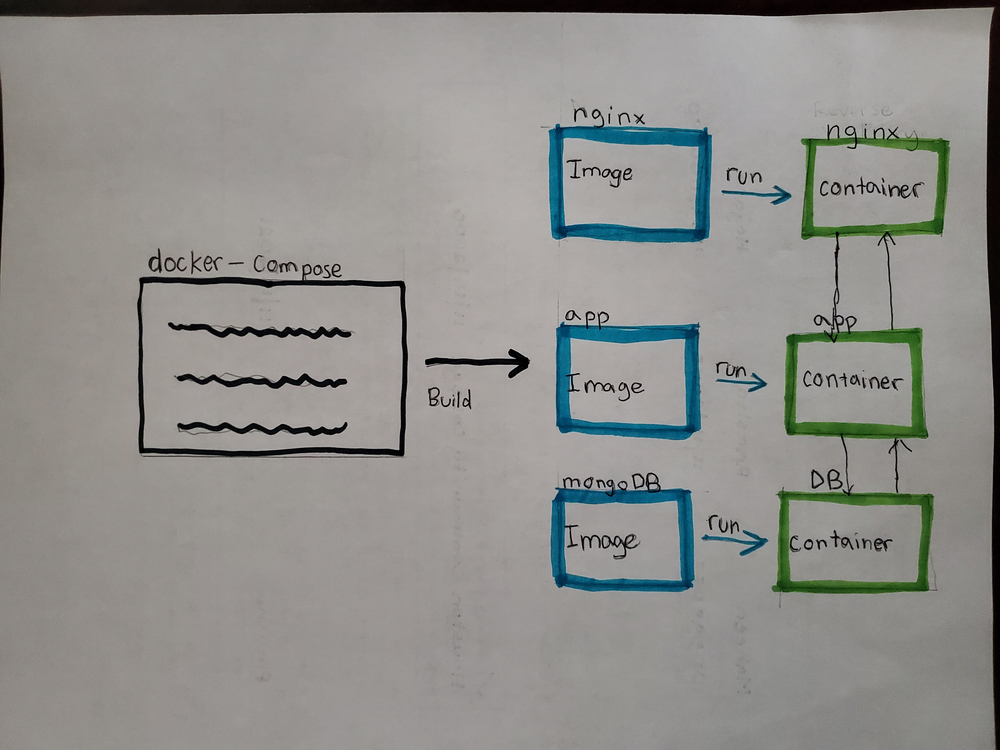
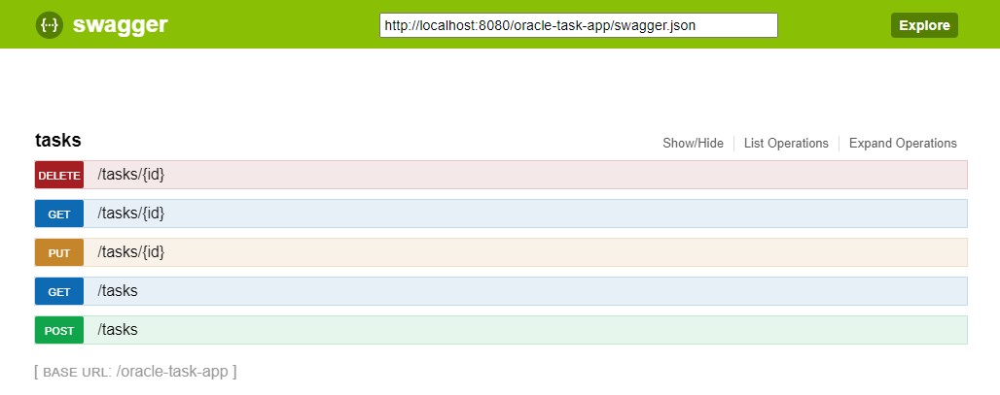

# Task Services
 Simple task service

## How to start

1. Run `mvn clean install` to build your application
2. Docker - create a network name `task-app-network`
3. Run `docker-compose up` for start the containers
      

Swagger
---
`http://localhost:8080/oracle-task-app/swagger`

Health Check
---
`http://localhost:8091/healthcheck`

## Architecture

## Swagger API Reference 

